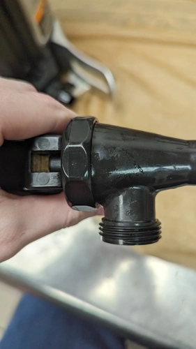
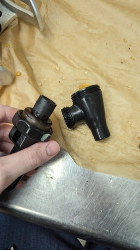
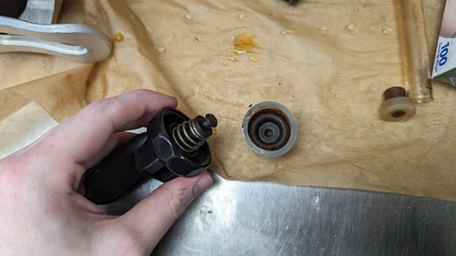
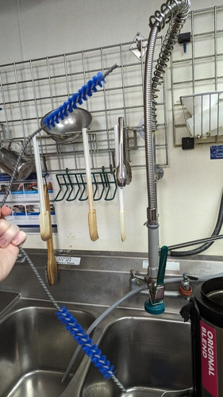
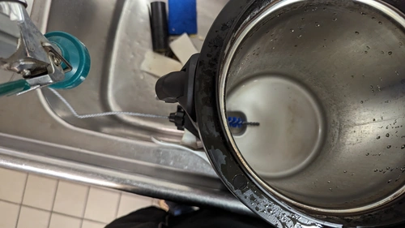

# Coffee Pots

!!! info
    This guide is written for the 3 pot Bunn servers (the giant metal cylinders). If your store has glass pots, soap and water will be everything you need.

Did you guys know that the cleaning tablets we use for the coffee pots don't clean the whole thing? They're not meant for the giant metal coffee pots already, so we need to actually clean them manually, which is what we're doing here. I'll break this down into actual steps so you don't have to read every part.

## Disassemble

This is the hardest part of the process, and depending on how long it's been since it's been cleaned, will require a bit of strength.

Firstly, take the spout off, you should see a little wing nut behind the spout itself, turn it to loosen the spout and take it off.

Next, take apart of the spout. The top part with the handle and the part where coffee pours out are actually separate pieces. The method I do to take it apart is gripping the rim of the handle and turning the spout until it comes apart.

Last part for the handle, take off the little rubber stopper inside. You might need to use a bit more force than you want and you gotta put your hand in there, but grab the top of the rubber piece and pull it out.

Finally, take the fill indicator out. Push down on the piece of plastic above it and pull the tube out (there are indents on the body of the coffee pot to tell you where to grip from). Take the rubber piece out on the bottom of the tube.

## Cleaning

Cleaning these parts isn't that hard, soak them in hot water with soap. If the rubber piece has grounds/feels grainy, apply some power dissolver and leave it on the counter for 5 minutes, then use the back of a sponge (the blue scrub pad) to scrape them off.

While those are soaking, grab a thin "hard bristle brush" and clean out the hole on the cofee pot. You will most likely get disgusted doing it, even when cleaning these on a regular basis, a lot of grounds do tent to build up inside the hole where coffee comes out, and where the fill indicator is. 

While cleaning the body, fill the body with soapy water and scrub the inside with one of the brushes in the store. Rinse the pot afterwards to remove all soap.

## Reassembly

To reassemble the pot, do everything you did in the [disassemble](#disassemble) section backwards.

If the plastic around the fill indicator is slightly popped off the body, you will need to hold it against the body while reattaching the fill indicator to prevent cracking it.

# Post clean rinse

After you reassemble, put the coffee pot back and run a full pot of water through it. To do this, load an empty basket (no filter), select the full option, and "Brew A". Once it's finished, empty the pot and put it back. Congrats, you have now cleaned a pot of coffee.