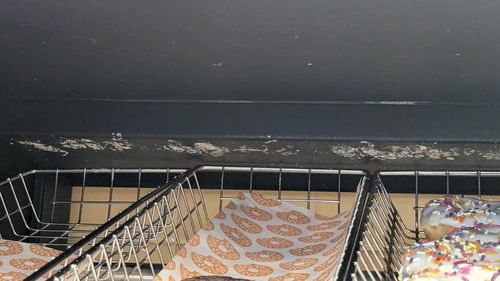

# Donut Case

Move the donut case away from the wall, it's on wheels don't worry, and sweep behind it.

If you're tasked with cleaning the actual inside of the case, get a cup of hot water and a scraping tool, the store should have a few knives around. Depending on where the sugar is built up in the case, either dip the scraping tool in the water and then scrape, or pour the water on it and then scrape.

