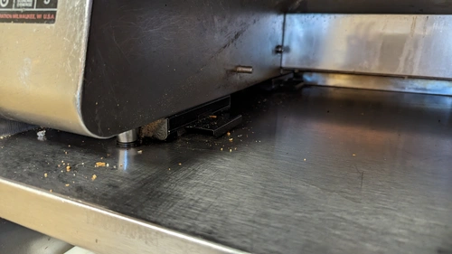

# Sandwich Station

!!! info
    This guide will be for Turbo Chef Ovens and Hatco toasters.

First, empty out all the warmers and turn them off if not done already. Wipe out the inside if there are crumbs in it. If somehow cheese gets on the inside and burns on, you need to ask God to help with that.

Next turn the toaster off, hold the power button until it says the cooling fans are on, pressing it does nothing. After it cools down, take the rack off the ramp. Then wipe the ramp down and put it in the sink.

Then remove the filter on the toaster and clean that out, it's under the ramp is and just slides out. Gently smack it against the counter or wash it to clear it.

Next brush off and clear crumbs from the white board and slicer. Throw them at the sink.

## Ovens

First, turn the oven off. Don't try this when it's on, you will hurt yourself.

Once the oven is off, remove the stone and the grate on the inside and put them somewhere safe. Please note that **YOU SHOULD NEVER GET THE STONE WET!**

??? info "Why can't we get the stone wet?"
    It will explode.
    ??? info "Why will it explode?"
        water in stone turns into steam

        steam tries to expand and rise
        
        it can't, pressure builds
        
        kablooey

After the stone is removed, grab the new bottle of TurboChef cleaner. Spray the inside of the door with the cleaner and use the wire brush that's next to the ovens to scrape it into the door. Don't breathe in what you're smelling, it's gonna smell bad. Get a bunch of paper towels and blue rags to clean off the cleaner. After a while, and a lot of scraping, the door should be clean. Do the same on the inside to clean the inside.

Now grab a brush and clean out the crumbs and burnt stuff. There shouldn't be much but a quick sweep never killed anyone.

Finally, grab the grate and the stone and put them back in, flip the stone over before putting it in and turn the oven back on. Congrats! You cleaned an oven.