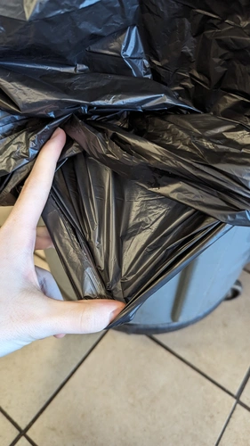
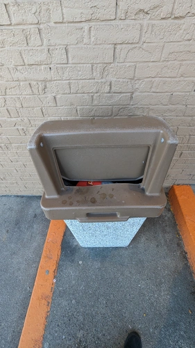

# Trashes

Get a roll of trash bags, there's probably 2-3 on the floor, if not grab one from the back. They're in a white box on the lower shelf.

First, remove both bags from the trash bin, tying it up and putting it where trash goes. Then take 2 bags and put them in the barrel. **ALWAYS DOUBLE BAG!** Tie the bags together to stop them from falling in. Don't forget about the outside trash also.

