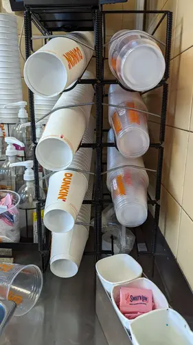
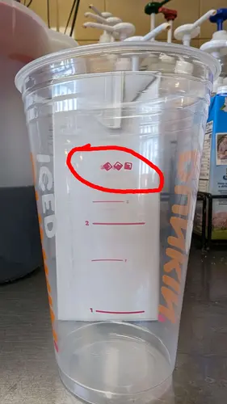
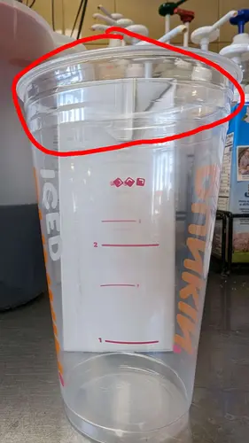
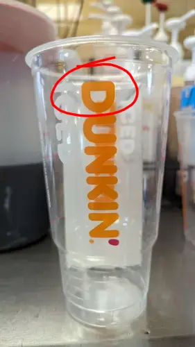

# Iced/Hot Coffee

Grab the sticker and look at it, the sticker will tell you **EVERYTHING** on how to make the coffee.

Place the sticker on the cup, the plastic cups are iced, the paper cups are hot. The sizes go from top to bottom (largest to smallest) in the cup holders.

The order of making a coffee is:

- Ice (if iced)
- Swirls & shots
- Dairy & Sugar

If the coffee is iced, fill 2/3 of the cup with ice. As of 2024-04-19 there is a little symbol above the "second fill line", aim for around there.

Next, add in the flavor swirls and shots. If a customer asks the difference, swirls are sweetened and shots are not. If a customer doesn't specify shot or swirl, default to shot.

Then, add the dairy and sugar. If the cup says regular, refer to the chart below for the amount to add. If the cup says black, no dairy is to be added.

|Size|Amount of dairy and sugar|
|---|---|
|Small|2|
|Medium|3|
|Large|4|
|Extra Large|5|

Lastly, fill the cup with coffee and put the lid on it, coldbrew will be in the pitcher to the side. If they ask for cold foam, leave some space near the top of the cup for it. For small and medium iced, there should be 3 lines near the top of the cup. For large iced, go for halfway up the "D" in "DUNKIN".

